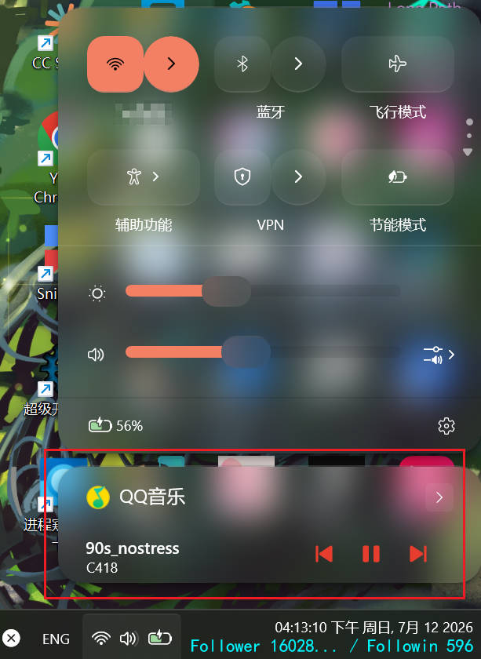

# 更好的歌词 BetterLyrics 说明

> 语雀文档链接（不再更新）：[https://www.yuque.com/wormwaker/tkpgqw/spwhbekbeycybdxw?singleDoc](https://www.yuque.com/wormwaker/tkpgqw/spwhbekbeycybdxw?singleDoc)
>

只打开 `Island 灵动岛` 是无法显示歌词的，你需要启用 `Render 渲染` 中的 `BetterLyrics 更好的歌词` 模块。

# 1. 基本模式介绍 
下面介绍几种 `Basic Mode 基本模式` 供你选择：

## 1.1 驱动模式 Driver (PRO)

【网易云专用】对于 `PRO专业版` 用户，请优先使用 **Driver (PRO) 驱动模式**，该模式下可以提前获取准确歌词，且能获取精准译文以及每句歌词的时间。如果 CloudMusic云音乐 实在无法连接【Disconnected】或者出现不同步的异常情形，则请回退至下面的 `Hook Render 挂钩渲染` 模式。

## 1.2 挂钩渲染模式 Hook Render

【网易云专用】0.8c 加入了新的模式：`Hook Render`，挂钩渲染，只对网易云音乐有效，100%准确，请优先使用这个！
会用到注入。
注入前要注意必须打开网易云的 `桌面歌词窗口`，否则无法更新歌词！
缺点：可能对译文的处理不够准确。如果译文代替了原文的位置，请考虑桌面歌词上设置->外文歌词翻译改成关闭。客户端有手动翻译的回退路线。如果没有打开 CloudMusic云音乐 模块（即没有对接驱动），则译文为客户端手动翻译，每一句歌词刚出现的时候会有译文的延迟。

配置项介绍：

`Unload DLL When Quit (退出时自动卸载DLL)`:
客户端退出时是否卸载 DLL，建议关闭，因为卸载后重新开启客户端需要重新注入。

## 1.3 SMTC 模式

新版本（v1.1）加入新的模式：`SMTC`，读取系统 SMTC 信息（包括曲名、艺人、进度等），搜索网易云歌词进行同步。
支持任何对接 SMTC 且具有实时进度条信息的音乐软件（例如`QQ音乐`）

> 如果你想知道你所使用的音乐软件是否支持 SMTC，你可以播放一首歌曲，然后点击右下角的网络图标：
> 
> 如果下方出现媒体信息且具有进度条则表示支持，可以使用这个模式。

相关 `BetterLyrics` 配置项介绍：

- `SMTC Exclude Browsers`: 对于每一个 `SMTC` 会话，自动排除和浏览器相关的进程，防止干扰。
- `SMTC Song Match Threshold (0~100)`: 在查找网易云相关歌曲时，歌名的匹配阈值。默认 90.0
- `SMTC Artist Match Threshold (0~100)`: 在查找网易云相关歌曲时，艺人的匹配阈值。默认 10.0，这里不推荐调的太高，因为音乐平台不同有很大差异
- `SMTC Whitelist Enabled`: 是否开启白名单，白名单的进程才能匹配。
- `SMTC Whitelist (Sep With Semicolon)`: 进程名白名单，多个进程用英文分号分隔。默认值 QQMusic.exe
- `SMTC Blacklist Enabled`: 是否开启黑名单，黑名单中的进程不会被匹配。
- `SMTC Blacklist (Sep With Semicolon)`: 进程名黑名单，多个进程用英文分号分隔。默认值 哔哩哔哩.exe

当然网易云音乐也可以使用 BetterNCM 安装 `SMTC` 相关插件。
*新版本网易云添加了内测的SMTC功能，但是不提供进度条信息，所以还是无法直接使用该模式。*

你可以使用 `/smtc list` 命令查看所有当前 Windows 中的 `SMTC 会话`。
示例输出：

```bash
 SMTC Sessions  (1)
========================================================================
#1 What If
  Artist: BlazinG
  Album: -
  Source: cloudmusic.exe
  State: Paused
------------------------------------------------------------------------
```

其他命令：

```bash
/smtc next
```
切换到下一首。

```bash
`/smtc prev`
```
切换到上一首。

```bash
`/smtc pause`
```
暂停当前媒体。

```bash
`/smtc resume`
```
继续播放当前媒体。

注意其中 `next, prev, pause` 优先选择播放中的媒体会话，`resume` 优先选择暂停中的媒体会话。

## 1.4 OCR 模式

如果上述方法都失败，可以考虑用老方法：OCR，也就是光学识别，文字提取。

*注意有些其他的模块【例如：`AutoTranslate自动翻译`，`Screenshot截图工具`，`OCR相关命令`】也会用到 TesseractOCR，下文可以一起参考：*
​
在群文件找到 tesseractocr 的安装程序，或者自行去官网 [https://tesseractocr.org/](https://tesseractocr.org/) 下载安装程序，打开并安装。

打开GUI，按 `Ctrl+F` 或者在上面选择 “搜索” 选项卡，搜索 tess 找到一个叫 `TesseractOCR` 的模块，右键打开配置，找到可执行文件路径，点击，然后按 `Ctrl+O` 弹出一个文件选择框，找到你刚刚安装的路径里面的 `tesseract.exe`，确认。


群文件找到 `chi_sim.traineddata`，这个是简体中文的模型文件，塞到你安装路径的 tessdata 文件夹下，文件夹下应该也有其他的模型文件，例如 `eng.traineddata` 等。如果你想识别其他语言，就安装对应的模型文件，都可以在官网上找来下载。

​
对于“更好的歌词”模块：
打开网易云音乐的 `桌面歌词` 窗口，并放在合适的位置，可以锁定，然后播放一首带歌词的音乐。


打开 `更好的歌词 BetterLyrics 模块`，看看是否有效果。如果没有效果，尝试下列手段：

1. 关闭后重新打开桌面歌词窗口

2. 解锁并拖动桌面歌词窗口

3. 切换歌曲

4. 重新打开 BetterLyrics 模块

5. 将 BetterLyrics 配置中的 Y Offset 纵坐标偏移改成 0 或者 70

6. 行号改成0或1

### `OCR 模式` 配置项介绍：

大多数的配置项都是 `OCR 模式` 的。下面是几个重要的配置项：

`Capture Mode 捕获模式`:
决定截图方式。`PrintWindow` 表示获取窗口图片，即使窗口有一部分离开屏幕也可以获取完整图像，建议使用。`BitBlt` 是全屏截图并截取，如果窗口离开屏幕就会出问题。

`Capture Cooldown (ms) 捕获冷却（毫秒）`:
每次截图的间隔时间，单位是毫秒。默认 700 毫秒。如果发现音乐歌词太快更新来不及，可以调低这个值。如果发现电脑卡顿，可以尝试调高这个值。

`Line Index 行号`:
决定歌词取识别结果的哪一行。默认为 0，表示第一行。

`Music Player Preset 音乐播放器预设`:
决定 OCR 模式的播放器预设。注意选择酷狗音乐时，需要注意 `Kugou Use Taskbar Lyrics` 配置项，如果你是任务栏歌词，就启用这个配置项。如果你的播放器不在其内，则选择 `Custom 自定义`。

`Pause When Menu On 菜单打开时暂停`:
打开 GUI 时是否暂停识别。

`Skip If Includes 如果包含则跳过`:
`Skip If Includes Enabled 是否启用如果包含则跳过`:
包含指定的符号时，跳过这一句歌词。

`Skip If Similarity Greater Than 相似度大于多少则跳过`:
前后歌词识别文本相似度高于多少时，跳过。范围 0~1 的小数，默认值 0.7，即 70%。


### `OCR 模式` 常见问题：

- Q: 报错找不到 `TesseractOCR 可执行文件`

- A: 路径错误，请重新选择 `tesseract.exe`。点击编辑框，按下 `Ctrl+Shift+O` 可以直接弹窗选择文件注意一下。
​

- Q: 报错 `OCR Failed`

- A: OCR 结果文件没有出现，大概率是因为没有安装相应的语言模型。
- 

- Q: 语言怎么识别错误

- A: 找到配置里面的 `Language`，由AI决定是根据歌词让AI决定语言类型，歌名推断是使用歌名的语言，其他就是选择指定语言。AI 识别也不是很准确
​

- Q: 不是网易云音乐，OCR 模式能识别吗

- A: 不能确保准确性。找到 `播放器样式`，改成你的样式。如果没有就选 `自定义`，然后修改桌面歌词窗口的类名和标题。类名和标题的获取可以用目标显示模块或者 `/here, /fore, /windows` 等命令

​
- OCR 模式会定期（取决于你设的冷却时间）启动 `tesseract.exe` 来识别歌词，可能会影响性能，请谨慎选择。

# 2. 全局配置项介绍

这些配置项不受 `Basic Mode 基本模式` 影响，全局生效:

`Display Mode 展示模式` :
歌词展示模式。推荐 `Island 灵动岛`。

`Notify Music Change 通知音乐变化`:
是否在切换歌曲时通知以及通知类型。

`Exclude Non-lyrics Content 排除非歌词内容`:
是否排除非歌词内容，例如 `纯音乐，请欣赏`，以及 `作曲: xxx` 等歌曲信息歌词行。

`Translation 翻译`:
是否翻译歌词，以及翻译的目标语言。

# 3. 其他常见问题解答

- Q: 怎么改展示模式

- A: 找到 `Display Mode` 展示模式项，你可以改成通知，弹幕，标题，花式文字，灵动岛，对话框等


- Q: 切换歌曲的时候的通知怎么改或者关闭

- A: 找到 `Notify Music Change 通知音乐变化` 置顶配置项，修改为你需要的通知类型。这个的原理是窗口标题字符串处理，不需要依赖其他手段，因此不能作为成功获取歌词的依据。


- Q: 能否翻译歌词
  
- A: 找到 `Translation 翻译` 置顶配置项，改为你需要的目标语言。